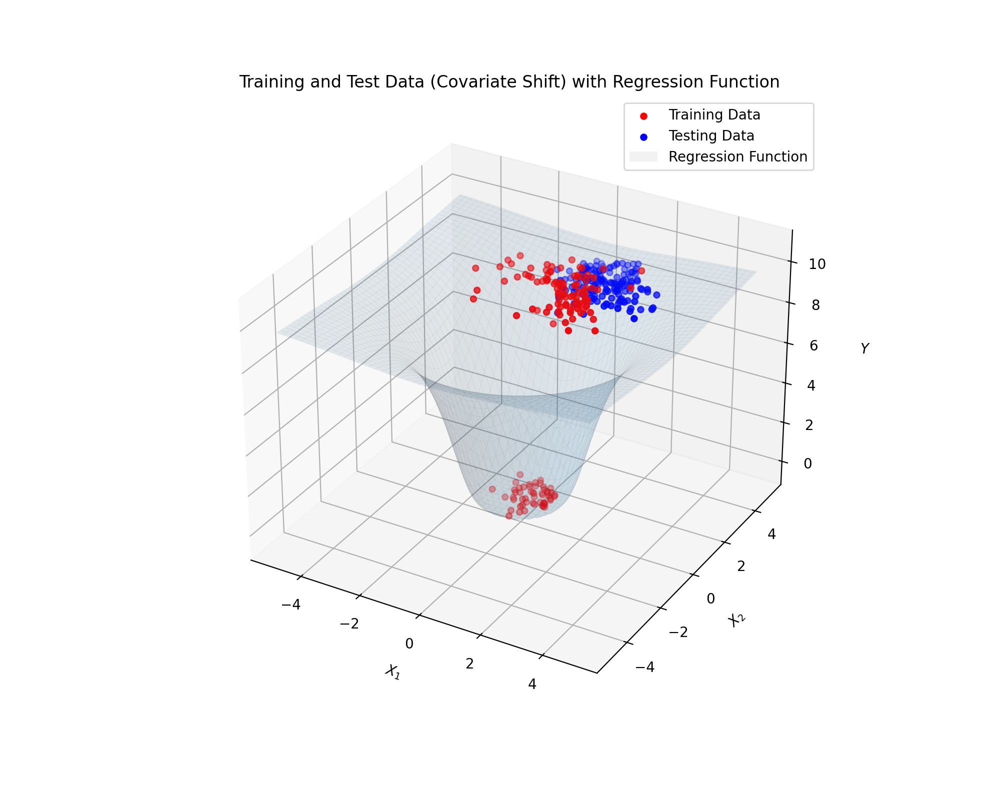

# KRR under covariate shift with IW correction and Nystrom approximation

Code accompanying the work:

**Computational Efficiency under Covariate Shift in Kernel Ridge Regression**
A. Della Vecchia, A. Watusadisi, E. De Vito, L. Rosasco  (NeurIPS 2025 - Spotlight Session)

📄 [Paper (PDF)](docs/DellaVecchia_covshift.pdf)
🔗 [Google Scholar](https://scholar.google.it/citations?view_op=view_citation&hl=it&user=aaeUheEAAAAJ&citation_for_view=aaeUheEAAAAJ:IjCSPb-OGe4C)

The goal is to study **covariate shift**—the setting where train and test input distributions differ while the conditional distribution (and then also the target regression function) remains the same —and to evaluate **importance-weighted** Kernel Ridge Regression (KRR) alongside its **Nyström** efficient and scalable approximation.

**Why this matters.** Classical KRR can deliver optimal statistical guarantees in RKHSs, but its \(\mathcal{O}(n^3)\) time / \(\mathcal{O}(n^2)\) memory costs limit scalability. Under covariate shift, we must also correct for the distribution mismatch, typically via **importance weighting (IW)**. This notebook examines whether **random subspace methods (Nyström)** preserve accuracy *while* reducing compute under distribution shift.

> **Takeaway.** Following the paper, the Nyström-accelerated, importance-weighted estimator targets **the same statistical accuracy** as the full IW-KRR—*with far better computational profile*—provided the subspace size is chosen appropriately.

**What you’ll find here.**
A simulation setting with controlled **train/test Gaussian distribution shift**.
Three models:
- **KRR** (vanilla)
- **IW–KRR** (importance-weighted)
- **IW–Nyström KRR** (importance-weighted with Nyström compression via BLESS)
- A **clean results summary** comparing mean test MSE and execution time across multiple runs.

The project includes both a clean **Jupyter notebook** and an **installable Python package** with a CLI.




  
  
## Install

```bash
pip install -e .
# (optional for 3D plot) 
pip install -e .[plot]
```

## Quick run

Use the console entry-point to run a short comparison with cross-validated hyperparameters and 5 random seeds:

```bash
covshift-compare
```

or directly:

```bash
python scripts/compare_models.py
```

## Package layout

```
src/covshift/
  __init__.py
  core.py      # config, sampling, models, CV, training, CLI
  plot.py      # optional 3D visualization (requires matplotlib)
  bless.py     # lightweight BLESS routine (vendored)
scripts/
  compare_models.py  # calls into covshift.core
```

